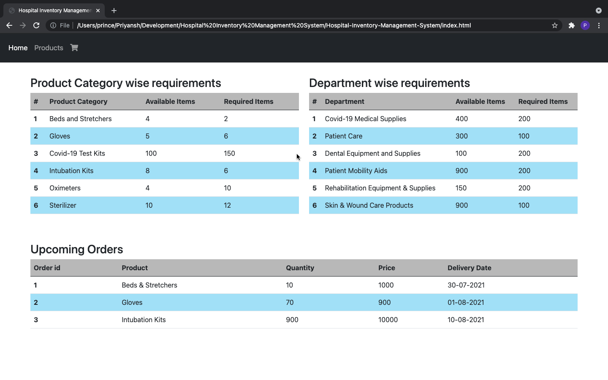
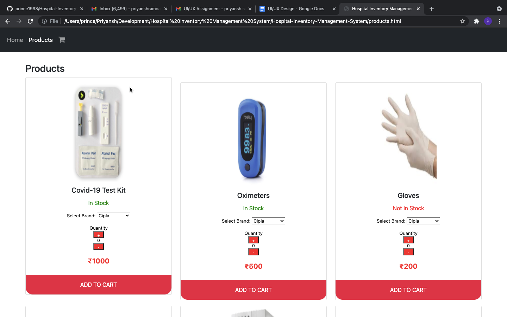
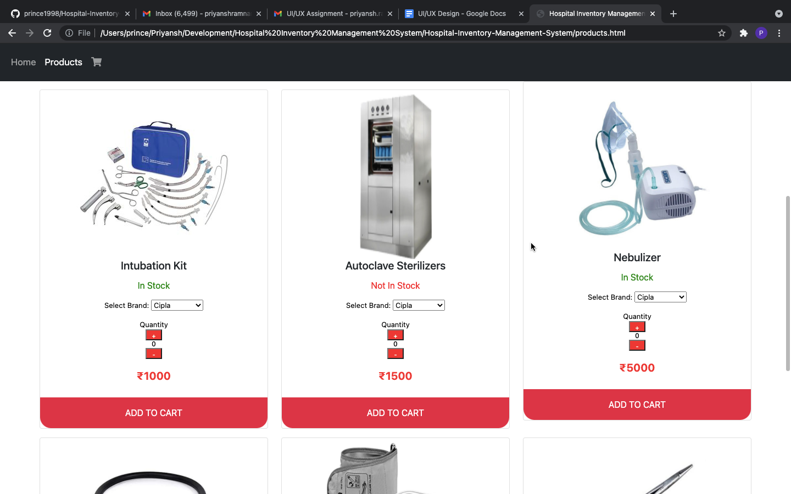
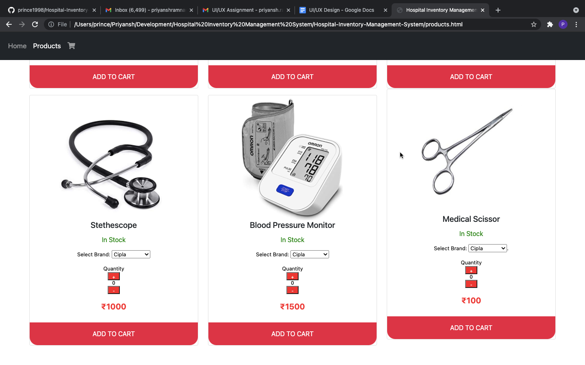
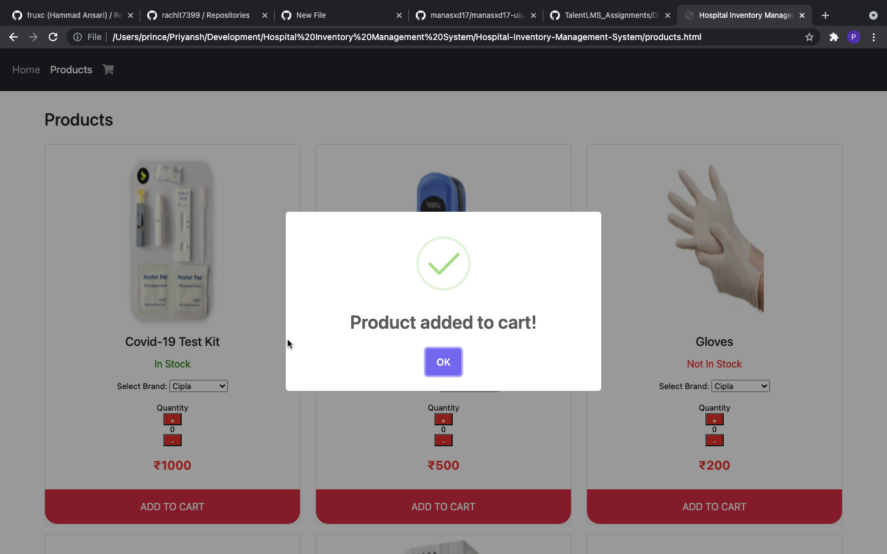
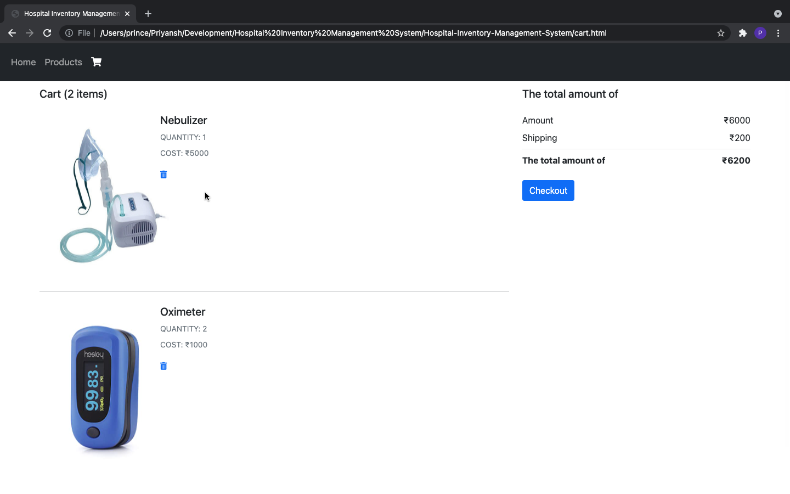
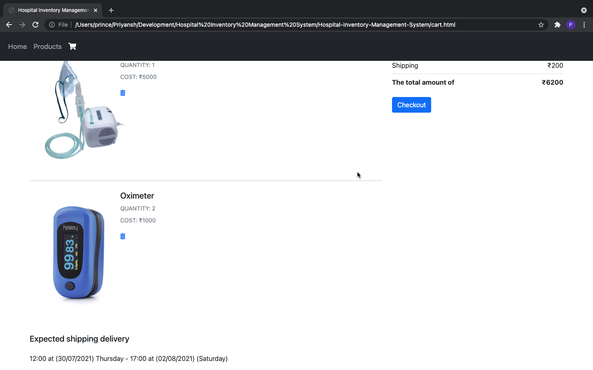

# Hospital Inventory Management System

This application is a static (front-end) web site to demonstrate UI design of a prospective Hospital Inventory Management System.

It consists of the following pages:
- Home Page - It consists of dashboard wherin the user can see the Product Catergory wise inventory requirements, the department wise inventory requirements and the upcoming orders in a tabular form.
- Products Page - Here the user can check whether the product is available. If the product is available, the user can add it to cart. Also, the user can increase the quantity of the product if required in the counter option. The user can also choose the brand of the product they require.
- Cart Page - Here the user can see all the items he/she has put in the cart. The cost of each individual item is displayed and the sum total is displayed in the right side of the page. The approximate delivery date is also mentioned in the bottom of the page.

## Folder Structure

- index.html: Home Page
- products.html: Products Page
- cart.html: Cart Page
- img: Product Images
- /css/styles.css: Page stylings
- screenshots: Web Site Screenshots

## Screenshots:

Home Page

Products Page (Top)

Product Page (Middle)

Product Page (Bottom)

Alert generated when product is added to cart

Cart Page (Top)

Cart Page (Bottom)

